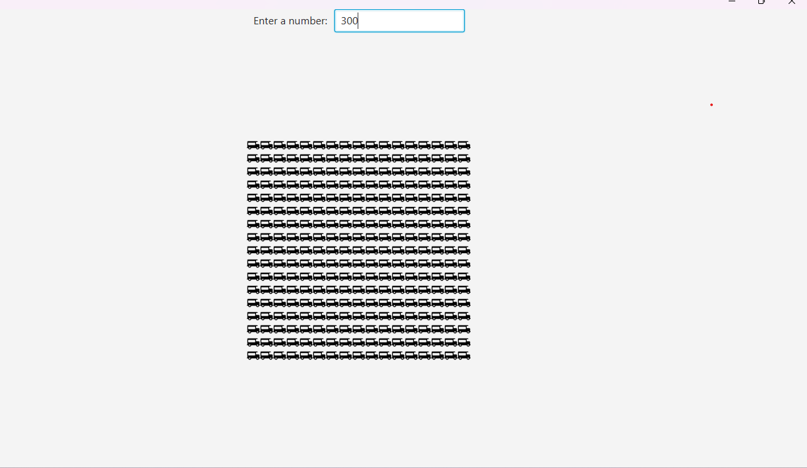

# Number Visualizer

This is a JavaFX program that visualizes how big a number is using truck icons. The user enters a number, and the program displays a square grid of truck icons with a size proportional to the square root of the input number.

## Usage

To use the program, simply enter a number in the input field and press enter. The program will update the truck visualization based on the input number.

## Requirements

The program requires Java 8 or later and the JavaFX library. You can also use Liberica JDK 11 that comes bundled with javaFx.

## Screenshots

## Credits

The truck icons used in this program are from [Icons8](https://icons8.com/icon/set/food-truck).

## License

This project is licensed under the MIT License. See the [LICENSE](LICENSE) file for details.
